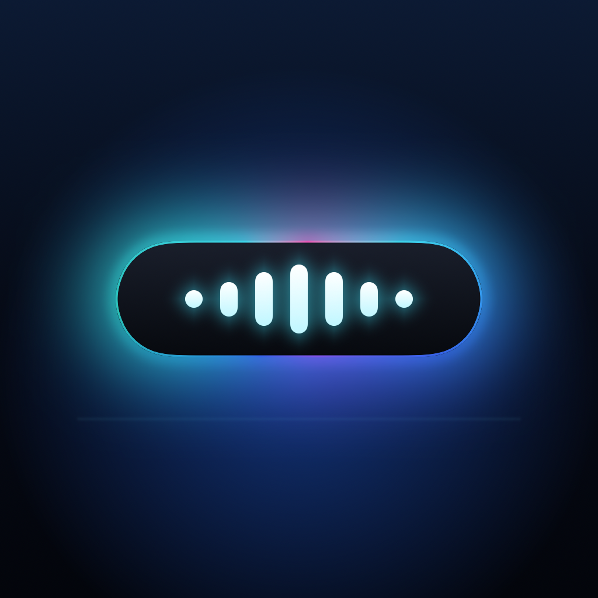
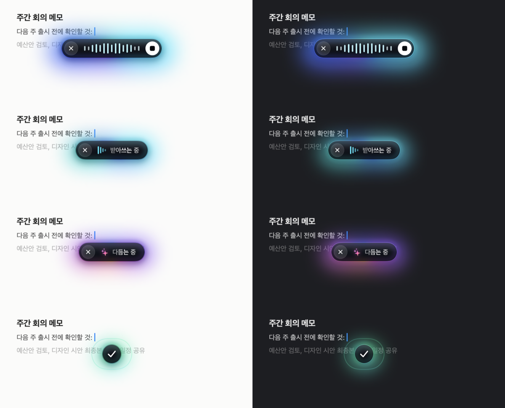
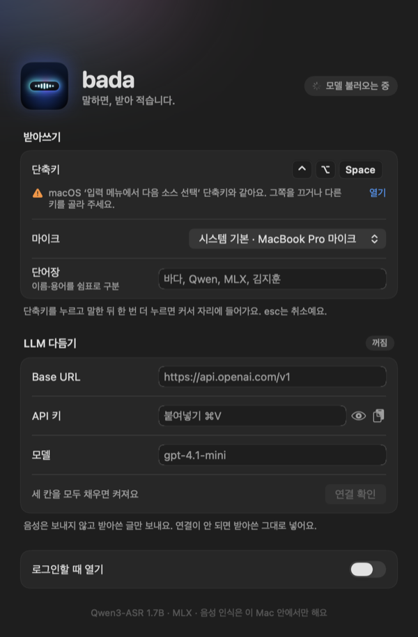

<p align="center"></p>

<h1 align="center">bada</h1>

<p align="center"><b>말하면, 받아 적습니다.</b><br>Mac을 위한 한국어 받아쓰기. 음성 인식은 이 Mac 안에서만 합니다.</p>

<p align="center"></p>

- **어디서나** 단축키 한 번이면 커서 바로 아래에 캡슐이 뜨고, 목소리에 맞춰 물결칩니다.
- **빠르고 정확하게** Qwen3-ASR 1.7B(MLX)가 Mac에서 돌아 15초 말을 약 1초에 받아 적습니다.
- **말끔하게** LLM을 연결하면 더듬은 말과 군더더기를 걷어 내고 짧고 명확한 문장으로 다듬습니다.
- **그 자리에** 결과는 원래 커서 자리에 입력되고 클립보드에도 복사됩니다.

## 설치

Apple Silicon Mac, macOS 14 이상에서 동작합니다.

1. [Releases](https://github.com/lee-lou2/bada/releases/latest)에서 `Bada-x.y.z.dmg`를 받아 Bada를 응용 프로그램 폴더로 옮깁니다.
2. 처음 열 때 “확인할 수 없음” 경고가 뜨면 **시스템 설정 → 개인정보 보호 및 보안**의 맨 아래에서 **그래도 열기**를 누릅니다. Apple 공증을 받지 않은 오픈소스 빌드라서 뜨는 경고입니다. (터미널: `xattr -dr com.apple.quarantine /Applications/Bada.app`)
3. 설정 창의 안내대로 마이크와 손쉬운 사용을 허용합니다.
4. 처음 한 번 음성 엔진과 모델(합쳐서 약 2.4GB)을 알아서 내려받아 설치합니다. 설정 창에 **음성 모델 준비됨**이 뜨면 끝입니다.

직접 빌드하려면 [Xcode Command Line Tools](https://developer.apple.com/xcode/resources/)(`xcode-select --install`)만 있으면 됩니다.

```sh
git clone https://github.com/lee-lou2/bada.git
cd bada
scripts/build.sh --install
```

## 사용법

| | |
| --- | --- |
| 받아쓰기 시작 / 끝 | `⌃⌥Space`, 또는 캡슐의 ■ |
| 취소 | `esc`, 또는 캡슐의 ✕ |
| 다듬기 건너뛰기 | 다듬는 중에 단축키, 또는 **바로 넣기** |

단축키가 macOS 단축키(예: 입력 소스 전환)와 겹치면 설정 창에 안내가 나옵니다.

## 설정

메뉴 막대의 bada 아이콘 → **설정…**



- **단축키**, **마이크**
- **단어장**: 이름과 용어를 쉼표로 적으면 인식과 다듬기 모두 그 표기를 따릅니다.
- **LLM 다듬기**: OpenAI 호환 Chat Completions의 Base URL, API 키, 모델. 세 칸이 다 차면 켜집니다. `…/v1`은 `…/v1/chat/completions`로 보냅니다. 추론 모델은 사고 수준을 가장 낮게 요청해 빠르게 끝냅니다. 연결에 실패하면 받아 적은 그대로 넣습니다.
- **로그인할 때 열기**

<br clear="right">

## 개인정보

- 음성은 저장하지도, 보내지도 않습니다.
- LLM 다듬기를 켜면 받아 적은 글과 단어장만 설정한 주소로 보냅니다.
- API 키는 `~/Library/Application Support/Bada/api-key`에 이 사용자만 읽을 수 있게 저장합니다.
- 음성 엔진은 `~/Library/Application Support/Bada/engine`에 따로 설치되어 시스템 Python을 건드리지 않습니다. 앱과 이 폴더를 지우면 깨끗이 삭제됩니다.
- 로그(`~/Library/Logs/Bada`)에는 시간과 길이만 남고 말한 내용은 남지 않습니다.

## 구조

```
Sources/Bada/   Swift 앱 (App · Dictation · Audio · Speech · Polish · HUD · Settings · Support)
engine/         음성 엔진 (Python, mlx-qwen3-asr)
scripts/        build.sh, sign.sh
Resources/      Info.plist, 권한, 앱 아이콘
```

앱은 Swift(AppKit + SwiftUI)이고, 음성 인식은 앱이 띄우는 Python 프로세스가 모델을 계속 올려 둔 채 처리합니다. 이 Python 환경은 앱이 처음 켜질 때 [uv](https://github.com/astral-sh/uv)로 만듭니다(버전·체크섬 고정, 패키지는 해시로 잠금).

## 라이선스

[MIT](LICENSE). 음성 모델은 [Qwen3-ASR 1.7B](https://huggingface.co/Qwen/Qwen3-ASR-1.7B)(Apache 2.0)의 MLX 변환본 [moona3k/mlx-qwen3-asr-1.7b-8bit](https://huggingface.co/moona3k/mlx-qwen3-asr-1.7b-8bit)을 씁니다.
